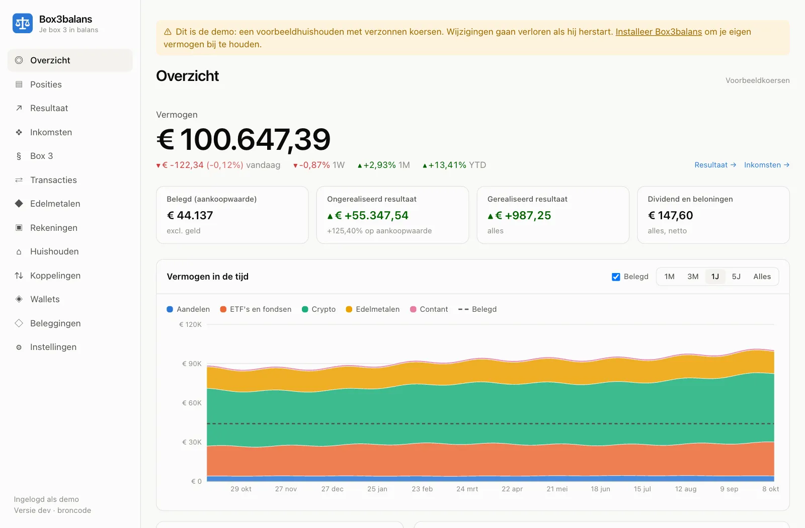
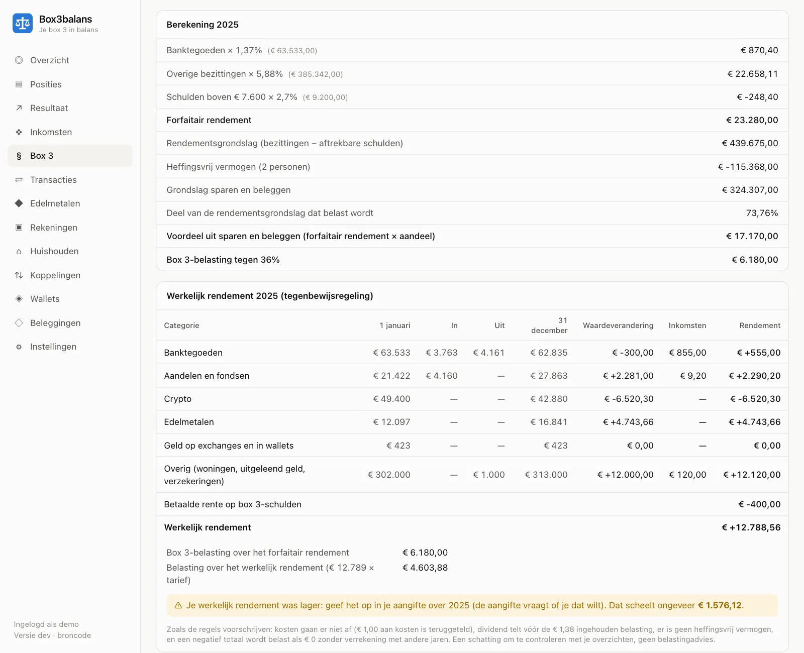
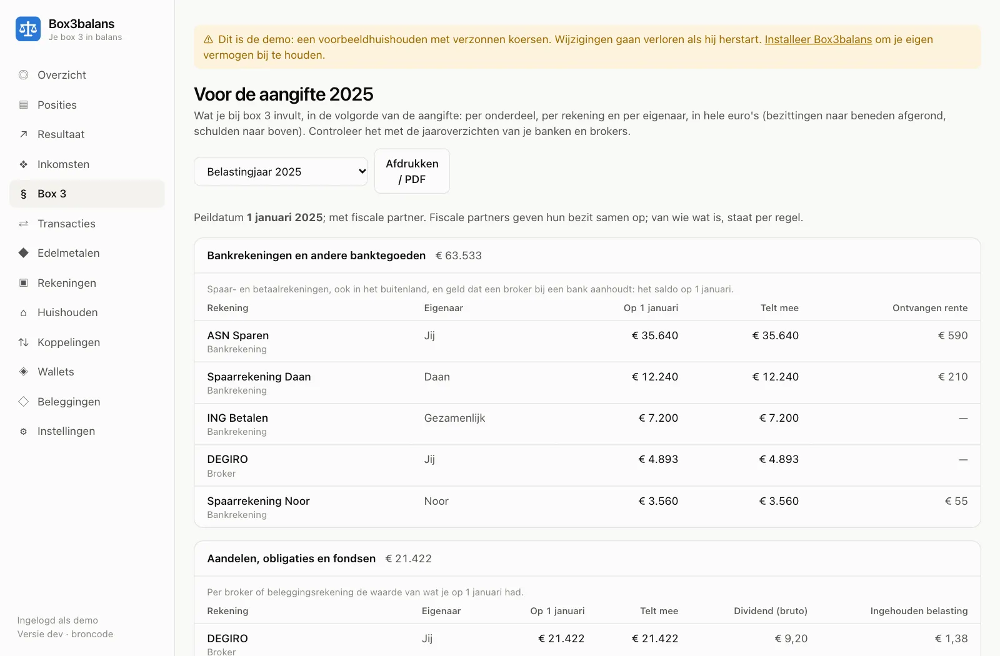
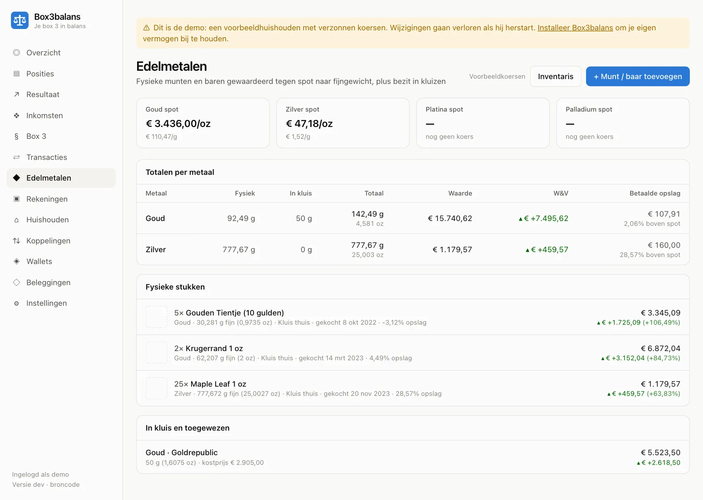

# Box3balans

_Je box 3 in balans._

Box3balans houdt je **box 3** bij, en alles wat erin zit: spaargeld, **aandelen en ETF's, crypto, goud en zilver** (thuis of in een kluis), een tweede woning, uitgeleend geld en schulden, alles in **euro's**. Met een schatting van je belasting, je werkelijk rendement en een overzicht voor de aangifte. Je draait het zelf, op je NAS, een thuisserver of je laptop. Je gegevens blijven dus bij jou: Box3balans stuurt niets naar de makers en verzamelt geen gebruiksgegevens. Het maakt alleen verbinding met koersbronnen, met de beurzen, brokers en blockchainverkenners die jij koppelt, en met GitHub als je de controle op nieuwe versies aanzet.

<picture>
  <source media="(prefers-color-scheme: dark)" srcset="docs/images/overzicht-dark.webp">
  
</picture>

> **Geen belastingadvies.** Box3balans maakt schattingen. Controleer de bedragen met de jaaroverzichten van je bank en broker voordat je ze in je aangifte gebruikt. Gebruik op eigen risico; er is geen garantie (zie de [licentie](LICENSE)).

**Status:** in ontwikkeling en bruikbaar. De app is in het Nederlands, met de termen uit de aangifte; Engels kan ook (_Instellingen → Weergave → Taal_). Wat er nog komt, staat op de [roadmap](docs/ROADMAP.md).

**Eerst kijken?** Start de [demo](#demo): een voorbeeldhuishouden met verzonnen koersen, zonder iets in te stellen.

**Vragen?** Stel ze bij [Discussions](https://github.com/zenonymous/box3balans/discussions/categories/q-a). Een fout of een concreet voorstel meld je als [issue](https://github.com/zenonymous/box3balans/issues/new/choose).

## Wat het kan

- **Overzicht:** vermogen door de tijd, de verdeling over beleggingssoorten, posities en rekeningen, en per positie de kostprijs en het gerealiseerde en ongerealiseerde resultaat.
- **Transacties** met de hand, via een **CSV-import** van vrijwel elke broker of beurs (exports van onder meer DEGIRO, Bitvavo, Rabobank Beleggen, Trade Republic en Trading 212 worden vanzelf herkend), via **koppelingen** met Bitvavo, Kraken, Coinbase en Interactive Brokers, en voor **wallets** op adres: Bitcoin, Ethereum en L2's, BNB Chain, Solana, Cardano, Dogecoin, Litecoin, XRP en Tron.
- **Edelmetaal:** munten en baren met gewicht, zuiverheid, foto's en een printbare inventaris (bijvoorbeeld voor je inboedelverzekering).
- **Rendement:** tijd- en geldgewogen rendement tegen een benchmark, een kostenoverzicht en verwachte dividenden.
- **Box 3 voor je hele huishouden:** jij, je fiscale partner en minderjarige kinderen; spaarrekeningen, beleggingen, een tweede of verhuurde woning, uitgeleend geld en schulden. Per rekening houd je transacties bij, of alleen de waarde op 1 januari, die je ook uit de export van je bank kunt laten halen. Per jaar het forfaitaire stelsel (met de afronding van de Belastingdienst), je **werkelijk rendement** voor de tegenbewijsregeling, een overzicht **voor de aangifte** in de volgorde waarin je het invult, en een vooruitblik op het stelsel vanaf 2028. Een startwizard helpt je in vier stappen op weg.
- **Veilig bewaard:** versleutelde back-ups in een map die je NAS elders kan kopiëren, tweestapsverificatie, een volledige wijzigingsgeschiedenis, en een lijst met wat aandacht nodig heeft.

### Zo ziet het eruit

Met de verzonnen gegevens van de [demo](#demo).

**Box 3 over een jaar:** de forfaitaire berekening, en het werkelijk rendement voor de tegenbewijsregeling, met wat het je scheelt.

<picture>
  <source media="(prefers-color-scheme: dark)" srcset="docs/images/box3-dark.webp">
  
</picture>

**Voor de aangifte:** per onderdeel, per rekening en per eigenaar, in de volgorde van het formulier.

<picture>
  <source media="(prefers-color-scheme: dark)" srcset="docs/images/aangifte-dark.webp">
  
</picture>

**Edelmetaal:** munten en baren met fijngewicht, waarde en de betaalde opslag, thuis of in een kluis.

<picture>
  <source media="(prefers-color-scheme: dark)" srcset="docs/images/edelmetaal-dark.webp">
  
</picture>

## Installeren

Je hebt een computer nodig met Docker en Docker Compose v2 (`docker compose version` werkt). Dat kan een NAS zijn (Synology, QNAP, Unraid, TrueNAS), een Raspberry Pi 4 of 5, een thuisserver of een laptop met Docker Desktop. Intel/AMD (x86-64) en ARM64 worden allebei ondersteund. Stap-voor-stapuitleg per systeem staat in [docs/installatie.md](docs/installatie.md).

1. Maak een map en zet [`docker-compose.yml`](docker-compose.yml) erin:

   ```bash
   mkdir box3balans && cd box3balans
   curl -fsSLO https://raw.githubusercontent.com/zenonymous/box3balans/main/docker-compose.yml
   ```

2. Start Box3balans:

   ```bash
   docker compose up -d
   ```

   De eerste keer worden de images gedownload. Na ongeveer een halve minuut toont `docker compose ps` beide containers als `healthy`.

3. Open `http://<je-server>:8080` en maak meteen je gebruiker aan, met een wachtwoord van minstens 12 tekens. Tot dat gebeurd is, kan iedereen die de server bereikt dat doen. _Aan de slag_ (te vinden op het lege overzicht) helpt je daarna in vier stappen op weg. Zet ook meteen tweestapsverificatie aan (_Instellingen_).

4. **Aanbevolen:** maak naast `docker-compose.yml` een bestand `.env` (voorbeeld: [`.env.example`](.env.example)) met minstens:

   ```bash
   BACKUP_PASSPHRASE='vier willekeurige woorden hier'   # versleutelt de back-ups
   PUID=1000                                            # jouw gebruikers-id (commando: id)
   PGID=1000                                            # jouw groeps-id
   ```

   Voer daarna `docker compose up -d` opnieuw uit. Bewaar de wachtwoordzin in je wachtwoordmanager: zonder kun je een versleutelde back-up niet terugzetten.

Een `.env` is niet verplicht. Bij de eerste start maakt Box3balans zelf een sleutel voor het versleutelen van API-sleutels en een databasewachtwoord aan, in het volume `app-data`.

**Controleren:** `docker compose logs app --tail 50`. De eerste regels tonen `Box3balans starting` met de versie. Na een herstart van je NAS kan één keer `Database not reachable yet…, waiting for it` voorbijkomen: de app wacht dan tot de database klaar is.

### In één container

Om het uit te proberen, of op een laptop met Docker Desktop, kan Box3balans ook in één container draaien, met de database ingebouwd (PGlite):

```bash
curl -fsSLO https://raw.githubusercontent.com/zenonymous/box3balans/main/docker-compose.lite.yml
docker compose -f docker-compose.lite.yml up -d
```

Voor een NAS of server is de standaardopstelling met een eigen PostgreSQL de stevigere keuze. Overstappen gaat met een back-up en terugzetten. Maak in deze variant back-ups vanuit de app (_Instellingen → Back-ups en export_): de opdrachtregel kan niet bij de database zolang de app hem open heeft. Moet het toch via de opdrachtregel (terugzetten, tweestapsverificatie uitzetten), stop dan eerst de app en voer de opdracht uit met `run --rm` in plaats van `exec`:

```bash
docker compose -f docker-compose.lite.yml stop
docker compose -f docker-compose.lite.yml run --rm app node dist/cli.js disable-2fa
docker compose -f docker-compose.lite.yml start
```

### Demo

Eerst rondkijken? De demo draait Box3balans met een voorbeeldhuishouden: Sanne, haar fiscale partner Daan en hun dochter Noor, met spaarrekeningen, beleggingen, crypto, edelmetaal, een vakantiehuis, uitgeleend geld en een studieschuld. De koersen zijn verzonnen. Je bent meteen ingelogd en er wordt niets bewaard; koppelingen, wallets en koersen ophalen staan uit.

```bash
docker run --rm -p 8080:8080 -e DEMO=true ghcr.io/zenonymous/box3balans:latest
```

Open `http://localhost:8080`. Met Ctrl+C stop je de demo, en alles is weg.

### Zelf bouwen

Wil je eigen wijzigingen draaien, bouw het image dan vanuit de broncode:

```bash
git clone https://github.com/zenonymous/box3balans.git && cd box3balans
docker compose -f docker-compose.yml -f docker-compose.build.yml up -d --build
```

Werk je op een andere computer dan je server, dan kopieert `scripts/deploy.sh gebruiker@nas` de laatste commit via SSH naar `~/box3balans` op de server en bouwt het daar. Geef een tweede argument voor een andere map. Moet `docker` daar met `sudo` (zoals op Synology): `DOCKER="sudo docker" scripts/deploy.sh gebruiker@nas`. Alleen gecommitte bestanden gaan mee, nooit `.env`, gegevens of back-ups.

### Bijwerken

```bash
docker compose pull
docker compose up -d
```

Je instellingen, database en back-ups blijven zoals ze zijn; databasemigraties draaien vanzelf bij het opstarten. Wil je horen wanneer er een nieuwe versie is, zet dan _Instellingen → Over → Controleren op nieuwe versies_ aan: Box3balans vraagt GitHub dan één keer per dag naar de nieuwste versie (GitHub ziet daarbij je IP-adres) en meldt een nieuwe versie bij _Aandacht nodig_. Standaard staat dat uit. Wil je eerst een back-up: `docker compose exec app node dist/cli.js backup`. Wil je op een vaste versie blijven, zet dan bijvoorbeeld `BOX3BALANS_VERSION=1.2.0` in `.env`. Wat er per versie verandert, staat bij de [releases](https://github.com/zenonymous/box3balans/releases).

### PostgreSQL upgraden

Kleine updates (18.x) komen mee met `docker compose pull`. Een nieuwe hoofdversie (bijvoorbeeld 18 → 19) kan de oude databestanden niet lezen; je verhuist de gegevens dan met een back-up. Dit is uitgeprobeerd met PostgreSQL 17 → 18: alle pagina's toonden daarna dezelfde gegevens.

1. Maak een back-up: `docker compose exec app node dist/cli.js backup`.
2. `docker compose down`.
3. Zet in `docker-compose.yml` het image van `db` op de nieuwe versie (bijvoorbeeld `postgres:19-alpine`) **en** hernoem het volume (`db-data` → `db-data-19`, op beide plekken). Het oude volume blijft zo onaangeroerd als terugvaloptie.
4. `docker compose up -d`. De app start met een lege database en maakt de tabellen aan.
5. Zet terug: `docker compose exec app node dist/cli.js restore /backups/<de back-up uit stap 1>`, dan `docker compose restart app`, en log opnieuw in.
6. Klopt alles, verwijder dan het oude volume: `docker volume rm box3balans_db-data`.

### Toegang buitenshuis (VPN)

Zet Box3balans niet open naar het internet: stuur poort 8080 niet door in je router. Wil je erbij vanaf je telefoon of laptop buiten de deur, gebruik dan een VPN:

- **WireGuard of Tailscale, gewoon:** open `http://<vpn-adres-van-je-server>:8080`. De VPN versleutelt het verkeer al. Laat `COOKIE_SECURE=false`.
- **Tailscale met HTTPS** (een echt `https://`-adres): zet MagicDNS en HTTPS-certificaten aan in de Tailscale-beheeromgeving en voer op de server uit (zo nodig met `sudo`):

  ```bash
  tailscale serve --bg 8080
  ```

  Box3balans staat dan op `https://<servernaam>.<tailnet>.ts.net`. Zet `COOKIE_SECURE=true` in `.env` en voer `docker compose up -d` uit. Gebruik vanaf dan alleen het https-adres: via het gewone `http://`-adres blijf je niet ingelogd. Laat `TRUST_PROXY=false`. Alle verzoeken delen dan één limiet voor inlogpogingen; voor één gebruiker is dat prima.

  Wil je dat het https-adres de enige ingang is, publiceer de poort dan alleen op de server zelf: verander in `docker-compose.yml` de regel onder `ports` in `"127.0.0.1:${HTTP_PORT:-8080}:8080"`.

## Back-ups en terugzetten

Een back-up is een gzip-bestand met **alle** gegevens behalve inlogsessies: rekeningen, transacties, edelmetaal met foto's, koersen, instellingen, koppelingen en wallets. Ze komen in de map **`backups` naast `docker-compose.yml`**:

- **Automatisch**, elke `BACKUP_INTERVAL_HOURS` (standaard 24). De nieuwste `BACKUP_KEEP` (standaard 14) automatische back-ups blijven bewaard.
- **Handmatig**, via _Instellingen → Back-ups en export → Nu back-up maken_, of `docker compose exec app node dist/cli.js backup`. Handmatige back-ups worden nooit automatisch verwijderd.
- **Vóór elke terugzetting**, als vangnet (`…-prerestore…`).

**Versleutel ze.** Met `BACKUP_PASSPHRASE` in `.env` (minstens 12 tekens) worden nieuwe back-ups versleuteld (`….json.gz.enc`, AES-256-GCM met een sleutel afgeleid via scrypt). Een verkeerde wachtwoordzin of een beschadigd bestand wordt herkend; er wordt nooit half teruggezet. **Zonder de wachtwoordzin kun je een versleutelde back-up niet terugzetten.** Zonder wachtwoordzin zijn back-ups gewone gzip-bestanden, met je wachtwoord-hash en al je financiële gegevens leesbaar erin; _Aandacht nodig_ herinnert je daaraan.

**Kopieën elders.** Laat de back-uptool van je NAS (Hyper Backup, rclone, een cloudsync …) de map `backups` meenemen. De bestanden zijn van `PUID`/`PGID` uit `.env`: zet die op je eigen gebruiker (het commando `id` op de NAS toont ze), zodat jij en je back-uptool erbij kunnen. Of gebruik _Downloaden_ naast een back-up in Instellingen.

**De app-sleutel.** API-sleutels van beurzen en de sleutel van je tweestapsverificatie staan versleuteld in de database, met een sleutel die Box3balans bij de eerste start aanmaakt in het volume `app-data`. Die sleutel zit niet in de back-ups. Verhuis je naar een andere server, bewaar hem dan in je wachtwoordmanager en zet hem daar als `APP_SECRET` in `.env`:

```bash
docker compose exec app cat /data/app-secret
```

Zonder die sleutel lukt het terugzetten ook, maar moet je de API-sleutels opnieuw invoeren en tweestapsverificatie opnieuw instellen (zet het eerst uit met `docker compose exec app node dist/cli.js disable-2fa`).

**Terugzetten** vervangt alle huidige gegevens door die uit de back-up, in één databasetransactie: alles wordt teruggezet of er verandert niets. Back-ups van oudere versies gaan prima; back-ups van een nieuwere versie worden geweigerd. Daarna is iedereen uitgelogd; log in met de gebruiker uit de back-up.

- Vanuit de app: _Instellingen → Back-ups en export → Terugzetten…_ naast een back-up, en typ `RESTORE`. Is de back-up met een eerdere wachtwoordzin gemaakt, vul die dan daar in.
- Vanuit een bestand, bijvoorbeeld op een nieuwe server: zet het in de map `backups` en voer uit:

  ```bash
  docker compose exec app node dist/cli.js restore /backups/box3balans-20261002-030000-auto.json.gz.enc
  docker compose restart app
  ```

  Dit gebruikt `BACKUP_PASSPHRASE` uit `.env`; voor een andere: `docker compose exec -e BACKUP_PASSPHRASE='…' app node dist/cli.js restore …`.

- Een versleutelde back-up buiten de app lezen: `docker compose exec app node dist/cli.js decrypt /backups/<bestand>.enc` zet het gewone `.json.gz` ernaast.
- `docker compose exec app node dist/cli.js list` toont de back-ups met grootte en datum.

**Extra vangnet (optioneel).** Een ruwe databasedump; terugzetten daarvan vraagt dezelfde PostgreSQL-versie:

```bash
docker compose exec db pg_dump -U box3balans box3balans | gzip > box3balans-db.sql.gz
```

**Exports.** _Instellingen → Back-ups en export_ downloadt ook **alle transacties** en de **huidige posities** als CSV. _Resultaat_, _Inkomsten_ en _Box 3_ hebben elk hun eigen CSV-export.

### Instellingen (`.env`)

Alles is optioneel. Zet alleen wat je wilt veranderen in `.env` naast `docker-compose.yml` en voer daarna `docker compose up -d` uit.

| Variabele               | Standaard          | Waarvoor                                                                                      |
| ----------------------- | ------------------ | --------------------------------------------------------------------------------------------- |
| `HTTP_PORT`             | `8080`             | Poort op de server                                                                            |
| `BOX3BALANS_VERSION`    | `latest`           | Welke versie je draait, bijvoorbeeld `1.2.0`                                                  |
| `BACKUP_PASSPHRASE`     | —                  | Versleutelt back-ups (minstens 12 tekens). Nodig om terug te zetten: bewaar hem goed          |
| `PUID` / `PGID`         | `1000`             | Eigenaar van de back-upbestanden: jouw gebruikers- en groeps-id                               |
| `BACKUP_INTERVAL_HOURS` | `24`               | Uren tussen automatische back-ups; `0` = uit                                                  |
| `BACKUP_KEEP`           | `14`               | Aantal automatische back-ups dat bewaard blijft                                               |
| `COOKIE_SECURE`         | `false`            | Op `true` als je Box3balans via HTTPS opent                                                   |
| `TRUST_PROXY`           | `false`            | Alleen achter een reverse proxy: `true`, het aantal proxy's, of hun IP-adres(sen)             |
| `SESSION_DAYS`          | `30`               | Hoe lang je ingelogd blijft                                                                   |
| `TIME_ZONE`             | `Europe/Amsterdam` | Kalender voor "welke dag of welk jaar" (box 3-peildatum, jaarresultaten)                      |
| `PRICE_REFRESH_MINUTES` | `15`               | Minuten tussen koersupdates                                                                   |
| `SYNC_INTERVAL_HOURS`   | `6`                | Uren tussen synchronisaties van koppelingen en wallets; `0` = alleen met de hand              |
| `SOLANA_RPC_URL`        | openbare RPC       | Eigen Solana-RPC (bijvoorbeeld een gratis Helius-sleutel) voor snellere eerste imports        |
| `ANKR_API_KEY`          | —                  | Gratis Ankr Advanced API-sleutel; nodig voor BNB Chain-wallets                                |
| `LOG_LEVEL`             | `info`             | `debug` logt ook elk verzoek                                                                  |
| `DEMO`                  | `false`            | `true`: de [demo](#demo), met een voorbeeldhuishouden in het geheugen; er wordt niets bewaard |
| `APP_SECRET`            | aangemaakt         | Eigen sleutel (minstens 32 tekens) voor API-sleutels, in plaats van de aangemaakte            |
| `POSTGRES_PASSWORD`     | aangemaakt         | Eigen databasewachtwoord, alleen bij de allereerste start; daarna staat het in de database    |

## Gebruiken

0. **Aan de slag** (_/start_, ook te vinden via het lege overzicht en _Instellingen_): in vier stappen je huishouden, je rekeningen en hun waarden op 1 januari, met meteen een schatting van je box 3. Wat je daar invult, kun je later gewoon op de andere pagina's aanpassen.
1. **Overzicht en Posities:** je vermogen door de tijd, de verandering van vandaag, de verdeling per beleggingssoort, per positie of per rekening, en elke positie per rekening met kostprijs en open en gerealiseerd resultaat.
2. **Aandacht nodig:** bovenaan de zijbalk verschijnt een rode of oranje link als iets aandacht nodig heeft: een mislukte synchronisatie, saldi die niet kloppen met een beurs of wallet, koersen die niet bijgewerkt konden worden, een negatief saldo, stortingen zonder waarde, opnames die niet aan een storting gekoppeld zijn, back-ups die mislukt zijn, te lang geleden zijn of niet versleuteld zijn, belastingregels die meer dan een jaar oud zijn, of (als je dat aanzet) een nieuwe versie. Elk punt linkt naar waar je het oplost; een waarschuwing kun je wegklikken tot er iets aan verandert.
3. **Geschiedenis** (_Instellingen → Geschiedenis_): elke wijziging aan transacties, beleggingen, rekeningen, edelmetaal, imports, koppelingen en wallets, veld voor veld, of jij of een synchronisatie of import het deed. Verwijderde transacties en edelmetaalstukken zet je daar terug.
4. **Huishouden** (_Instellingen → Huishouden_): jouw naam, je partner en je kinderen, met geboortedatum en wie het gezag heeft. Daarmee weet Box3balans welke rekeningen in jouw box 3 meetellen, en voor hoeveel.
5. **Rekeningen:** maak er één per plek waar je iets aanhoudt: banken (ING-spaarrekening), brokers (DEGIRO), beurzen (Bitvavo), wallets (Ledger), kluizen (Goldrepublic), thuis (de kluis), en ook een tweede of verhuurde woning, uitgeleend geld, een kapitaalverzekering of een schuld. Per rekening kies je:
   - **van wie:** van jou, van je partner, van jullie samen (met jouw aandeel, meestal 50%) of van een kind;
   - **hoe je hem bijhoudt:** met **transacties** (aankopen, verkopen, dividenden: met de hand, uit een CSV of via een koppeling; dan krijg je koersen, rendementen en geschiedenis), of met **waarden per jaar**: alleen de waarde op 1 januari en wat er in het jaar binnenkwam, uitging en werd verdiend. Dat is genoeg voor box 3. Woningen, uitgeleend geld, schulden en verzekeringen gaan altijd zo.
6. **Beleggingen:** zoek in Yahoo Finance op naam, ticker of ISIN, of in CoinGecko op munt. Kies de notering die je echt verhandelt (bijvoorbeeld `IWDA.AS` in plaats van `IWDA.L`). Goud, zilver, platina, palladium en euro's staan er al.
7. **Transacties:** aankoop, verkoop, storting, opname, dividend (bruto plus ingehouden belasting), stakingbeloning, kosten betaald in de belegging zelf, split, en **overboekingen** tussen rekeningen, die de kostprijs meenemen. Transacties in een vreemde munt krijgen automatisch de ECB-koers van die dag; die kun je aanpassen.
8. **Edelmetalen:** voeg munten en baren toe met gewicht en zuiverheid, of kies een voorbeeld (Krugerrand, Maple Leaf, Gouden Tientje, standaardbaren …). Stukken worden gewaardeerd tegen de spotprijs van het fijngewicht. Vul je de spotwaarde bij aankoop in, dan zie je de betaalde opslag. Metaal in een kluis (Goldrepublic) boek je als aankopen in **grammen** op Goud of Zilver. Elk stuk kan tot 8 **foto's** hebben (verkleind in de browser, zonder locatiegegevens). _Inventaris_ print een lijst per bewaarplek, of slaat die op als pdf, met foto's, gewichten, aankoopgegevens en waarde.

### Waarden per jaar en bankexports

Voor een rekening met **waarden per jaar** (_Rekeningen → Waarden per jaar_) vul je per jaar in:

- **de waarde op 1 januari**: van het jaaroverzicht van je bank of broker, of het saldo aan het eind van 31 december. De waarde op 31 december is de waarde op 1 januari van het jaar erna, dus die vul je niet apart in;
- **geld erin en eruit** in dat jaar (stortingen en opnames);
- **inkomsten**: rente of dividend dat op de rekening binnenkwam, huur van een verhuurde woning, rente op uitgeleend geld; bij een schuld de **betaalde rente**;
- **kosten** (alleen voor de vooruitblik op 2028, waar ze aftrekbaar zijn).

Bij een **woning** vul je de WOZ-waarde in die voor dat jaar geldt (die met waardepeildatum 1 januari van het jaar ervoor). Verhuur je hem met huurbescherming, vink dan _Verhuurd_ aan en vul de jaarhuur in: hij telt dan voor een deel van de WOZ-waarde (de leegwaarderatio, 73% tot 100%, afhankelijk van de huur als percentage van de WOZ-waarde). Je eigen woning hoort niet in box 3 (dat is box 1).

**Bankexport inlezen.** Bij een bankrekening haalt _Bankexport inlezen_ de saldi op 1 januari, de rente en het geld erin en eruit per jaar uit de transacties die je bij je bank downloadt. Box3balans leest:

- **CSV met een saldokolom**, zoals van ING (_Saldo na mutatie_), Rabobank (_Saldo na trn_), Knab, Triodos en andere banken; meerdere rekeningen in één bestand worden uit elkaar gehouden;
- **het TAB-bestand van ABN AMRO**;
- **CAMT.053**, het standaard afschriftformaat dat de meeste banken aanbieden;
- **CSV zonder saldo's** (zoals van bunq): dan vul je het saldo na de laatste regel in, en rekent Box3balans de rest terug.

Rente herken je aan de omschrijving ("rente", "creditrente", "interest"). Je ziet eerst per jaar wat er gevonden is: een geschat saldo (omdat het bestand halverwege een jaar begint of eindigt) en de totalen van jaren die het bestand maar deels beslaat, staan uit tot je ze aanvinkt. Er wordt pas iets opgeslagen als je in de tabel op _Opslaan_ drukt.

In januari herinnert _Aandacht nodig_ je eraan de waarden op 1 januari van het nieuwe jaar in te vullen.

### CSV-import

_Transacties → CSV importeren_ leest exports van vrijwel elke broker, beurs of spreadsheet.

**Herkende exports.** Deze bestanden herkent Box3balans zelf; je hoeft dan geen kolommen te kiezen:

| Aanbieder         | Welk bestand                                                          | Wat er wordt ingelezen                                                                        |
| ----------------- | --------------------------------------------------------------------- | --------------------------------------------------------------------------------------------- |
| DEGIRO            | _Rekeningoverzicht_ (Account.csv) of _Transacties_ (Transactions.csv) | Aankopen en verkopen met kosten; uit het rekeningoverzicht ook dividend met dividendbelasting |
| Bitvavo           | Transactiegeschiedenis (CSV)                                          | Alles, met stortingen en opnames in euro's                                                    |
| Coinbase          | Transactierapport (CSV)                                               | Aankopen, verkopen, omzettingen, versturen en ontvangen, beloningen                           |
| Kraken            | _Ledgers_ (ledgers.csv)                                               | Alles tegen euro's, met staking; transacties tussen twee munten via de API-koppeling          |
| Rabobank Beleggen | Mutaties & nota's (CSV)                                               | Alles, met stortingen, kosten en rente                                                        |
| Trade Republic    | Transactie-export met acht kolommen (ook die van pytr)                | Alles, met stortingen, opnames en rente                                                       |
| Trading 212, BUX  | Geschiedenis (CSV)                                                    | Aankopen, verkopen met kosten, dividend                                                       |
| Saxo              | Transactieoverzicht (Excel, opgeslagen als CSV)                       | Aankopen, verkopen met kosten, dividend                                                       |
| Revolut           | Aandelenoverzicht (CSV)                                               | Aankopen, verkopen, dividend                                                                  |

Waar een bestand alles in euro's heeft (Bitvavo, Kraken, Rabobank, Trade Republic), komen ook stortingen en opnames mee, zodat het geldsaldo klopt. Bij de andere laat Box3balans het geld weg en volgt het alleen je beleggingen; bij het controleren staat wat er is weggelaten. Deze formaten zijn gebouwd op openbare voorbeeldbestanden (onder meer van het project Export-To-Ghostfolio) en nog niet getest met echte exports: klopt er iets niet, kies dan _Zelf de kolommen kiezen_ en [meld het](https://github.com/zenonymous/box3balans/issues/new/choose), het liefst met een geanonimiseerd voorbeeld.

Bij andere bestanden:

1. **Kies de rekening en het bestand.** Puntkomma's of komma's, decimale komma's of punten, een byte order mark, titelregels boven de kopregel en Windows-codering worden allemaal herkend.
2. **Controleer de kolommen.** Box3balans raadt welke kolom wat is aan de hand van gangbare Engelse en Nederlandse kopjes (Datum, Aantal, Koers, Valuta …) en toont per kolom een voorbeeldwaarde. Het soort transactie komt uit een kolom, is voor elke regel hetzelfde, of volgt uit het teken van het aantal (negatief = verkoop, zoals in sommige brokerexports). Elke waarde in een soortkolom ("Koop", "Staking", "Airdrop" …) koppel je aan een soort of sla je over. Bewaar de instellingen onder een naam: bestanden met dezelfde kolommen gebruiken ze dan vanzelf.
3. **Bekijk alles voordat je importeert.** Er wordt niets opgeslagen tot je op _… transacties importeren_ drukt. Het voorbeeld toont:
   - **Nieuw:** wordt geïmporteerd.
   - **Al geïmporteerd:** dezelfde regel uit een eerdere import van dit of een overlappend bestand.
   - **Mogelijk dubbel:** dezelfde belegging, soort, dag en hoeveelheid als een transactie uit een andere bron (een koppeling, handmatige invoer of een import met andere instellingen). Wordt overgeslagen, tenzij je _Toch importeren_ aanvinkt.
   - **Probleem:** een regel die niet te lezen is, met de reden (bijvoorbeeld een datum of getal dat niet wordt begrepen).
   - **Beleggingen:** op welke belegging elk symbool of ISIN wordt geboekt. Bestaande worden hergebruikt; nieuwe worden opgezocht in Yahoo (op ISIN, bij voorkeur een euronotering) of CoinGecko (op symbool) en bij het importeren aangemaakt. Kies een andere als de match niet klopt.

Tijden zonder tijdzone worden gelezen als lokale tijd (`TIME_ZONE`). Prijzen in een vreemde munt krijgen de ECB-koers van die dag. Beloningen en cryptostortingen zonder prijs krijgen de slotkoers van die dag. Crypto-opnames en -stortingen worden gekoppeld aan overboekingen naar je andere rekeningen, net als bij synchronisaties.

**Ongedaan maken:** _Eerdere imports_ toont elke import met de knop _Terugdraaien_, die precies de transacties verwijdert die de import aanmaakte. Transacties die je los verwijdert, blijven weg als je hetzelfde bestand opnieuw importeert.

**Sjabloon:** voor alles zonder bruikbare export vul je [het sjabloon](server/src/import/mapping.ts) in (_↓ Template_ op de importpagina). Kolommen: `date` (JJJJ-MM-DD), `time`, `type` (buy, sell, deposit, withdrawal, dividend, reward, fee, split), `symbol`, `isin`, `name`, `asset_type` (stock, etf, crypto, metal, cash), `quantity` (bij een split: de verhouding, bijvoorbeeld 4), `price`, `total`, `currency`, `fee`, `amount` en `tax_withheld` (dividenden), `notes`, `id`.

Wil je dat Box3balans het bestand van jouw broker of bank vanzelf herkent? Stuur een geanonimiseerd voorbeeld via [een issue](https://github.com/zenonymous/box3balans/issues/new/choose).

### Koppelingen met beurzen en brokers

**Koppelingen** importeert de geschiedenis via API's met alleen leesrechten: **Bitvavo**, **Kraken**, **Coinbase** (een CDP-sleutel met ECDSA) en **Interactive Brokers** (Flex Web Service). De verbindingsdialoog noemt per aanbieder precies welke rechten je geeft. Sleutels worden gecontroleerd met een echte leesopdracht, versleuteld opgeslagen (AES-256-GCM, met een sleutel afgeleid van de app-sleutel) en nooit teruggestuurd of gelogd.

Elke synchronisatie:

1. **Importeert** aankopen, verkopen, stortingen, opnames, stakingbeloningen, dividenden (met ingehouden belasting) en rente als gewone transacties (`source: api`). Ontbrekende beleggingen worden vanzelf aangemaakt: munten via CoinGecko (de grootste marktwaarde bij dat symbool), effecten via Yahoo op ISIN, op de beurs die IBKR noemt.
2. **Boekt het geld:** aankopen gaan af van en verkopen gaan naar het geldsaldo van de rekening in de handelsvaluta, zodat euro-saldi op een beurs kloppen.
3. **Waardeert in euro's:** fiattransacties tegen de ECB-koers van die dag. Stakingbeloningen, cryptostortingen en crypto-naar-cryptotransacties tegen de slotkoers van die dag (Yahoo `SYM-EUR`, met CoinGecko als terugval). Coinbase levert de eurowaarde zelf, mits je basisvaluta bij Coinbase EUR is.
4. **Koppelt overboekingen:** een crypto-opname van de ene rekening en een passende storting op een andere (binnen 5 dagen, minstens 95% aangekomen) worden één overboeking, zodat de kostprijs meegaat. Klopt een koppeling niet, open dan een van beide onder _Transacties_ en kies **Ontkoppelen**; die twee worden daarna nooit meer vanzelf gekoppeld.
5. **Vergelijkt saldi** met wat de beurs meldt. Verschillen staan op de pagina _Koppelingen_, met een knop om ze in één keer recht te zetten.

Opnieuw synchroniseren is veilig: niets wordt dubbel geboekt. Je kunt geïmporteerde transacties aanpassen; een nieuwe synchronisatie overschrijft je wijzigingen nooit. Geïmporteerde transacties die je verwijdert, blijven weg.

**Staking op een beurs.** Gestakete munten blijven van jou, dus erin of eruit gaan is geen verkoop en geen opname:

- **Kraken:** gestakete, opt-in- en auto-earn-saldi (`DOT.S`, `ETH2.S`, `SOL.F`, `USDC.M` …) tellen als de munt zelf. Verplaatsingen tussen de spot- en earn-portemonnee worden overgeslagen, ook de oudere "earn"-regels zonder kosten. Verplaatsingen die Kraken als twee losse regels boekt (bijvoorbeeld `ETH2.S` terug naar ETH) vallen tegen elkaar weg als ze binnen twee dagen van elkaar staan; een recente regel wacht één synchronisatie op zijn tegenhanger. Beloningen, airdrops en uitnodigingsbonussen zijn inkomsten. Omzettingen bij een delisting zijn transacties. Kraken's tegoed voor handelskosten (KFEE) wordt genegeerd.
- **Bitvavo:** munten in vaste staking tellen mee via het aparte stakingsaldo. Vastzetten (vaste staking of uitlenen) is geen opname; komt het terug, dan is alleen wat er bovenop komt de beloning. Een geannuleerde opname wordt teruggedraaid (op niet-terugbetaalde kosten na), en verplaatsingen tussen Bitvavo's eigen portemonnees vallen tegen elkaar weg.
- **Coinbase:** de oude ETH2-portemonnee (gestakete ether) telt als ETH, beloningen inbegrepen. Verplaatsingen tussen je Coinbase-portemonnees (kluizen, andere portfolio's, het opheffen van ETH2) vallen tegen elkaar weg als de sleutel beide kanten ziet; anders zijn het een storting of opname.

Bekende beperkingen: bij Bitvavo gaat de koppeling ervan uit dat kosten bovenop het verzonden bedrag komen (in de CSV-export zitten ze in het bedrag), en Bitvavo documenteert niet wat er in de regels voor vaste staking en uitlenen staat; de saldovergelijking laat het zien als een van beide niet klopt. Coinbase meldt handelskosten niet apart. IBKR Flex levert maximaal 365 dagen per opvraging, slaat opties en futures over en verwerkt geen aandelensplitsingen (de saldovergelijking laat die zien).

### Wallets (eigen beheer, op adres)

**Wallets** volgt adressen alleen-lezen, via gratis openbare blockchainverkenners. Alleen BNB Chain vraagt een (gratis) API-sleutel. Box3balans vraagt nooit om je seed phrase of privésleutels en bewaart die ook niet.

| Blockchain                                                          | Bron                               | Opmerkingen                                                                                                                                                                                                                                                                     |
| ------------------------------------------------------------------- | ---------------------------------- | ------------------------------------------------------------------------------------------------------------------------------------------------------------------------------------------------------------------------------------------------------------------------------- |
| Bitcoin                                                             | mempool.space                      | Adressen of **xpub/ypub/zpub**. Uitgebreide sleutels worden doorzocht met een gap limit van 20, voor zowel ontvangst- als wisselgeldadressen. Legacy, nested SegWit, native SegWit en **Taproot** (kies "Taproot" bij een BIP86-xpub)                                           |
| Litecoin                                                            | litecoinspace.org                  | Adressen of Ltub/Mtub/xpub-sleutels                                                                                                                                                                                                                                             |
| Ethereum, Arbitrum, Optimism, Base, Polygon, Unichain, Ink, Soneium | Blockscout                         | De munt zelf, interne overboekingen en ERC-20-tokens. Je kunt hetzelfde adres in één keer op meerdere ketens volgen                                                                                                                                                             |
| BNB Chain                                                           | Ankr Advanced API (`ANKR_API_KEY`) | BNB en BEP-20-tokens. Vraagt een gratis Ankr-account (zie hieronder). Ankr meldt geen interne transacties: BNB die een contract uitbetaalt (bijvoorbeeld bij het ruilen van een token naar BNB) ontbreekt in de geschiedenis en verschijnt als verschil dat je kunt rechtzetten |
| Solana                                                              | openbare RPC (of `SOLANA_RPC_URL`) | SOL en SPL-tokens. Grote geschiedenissen komen er geleidelijk in (ongeveer 1.500 transacties per synchronisatie) door de limiet van de openbare RPC                                                                                                                             |
| XRP Ledger                                                          | xrplcluster.com                    | XRP-betalingen; uitgegeven tokens worden overgeslagen                                                                                                                                                                                                                           |
| Tron                                                                | TronGrid                           | TRX en TRC-20-tokens (zoals USDT)                                                                                                                                                                                                                                               |
| Cardano                                                             | Koios (gratis openbare API)        | ADA, native tokens en **stakingbeloningen** (gedateerd wanneer ze opneembaar worden; teruggekregen borg is geen inkomen). Plak het stake-adres (stake1…) of een ontvangstadres: Box3balans volgt de hele wallet via de stake-sleutel                                            |
| Dogecoin                                                            | BlockCypher (gratis)               | Adressen of **dgub/xpub** (BIP44, gap limit 20). De gratis laag staat 100 verzoeken per uur toe: een grote geschiedenis of een nieuwe xpub kan een paar synchronisaties duren                                                                                                   |

Zo werkt een wallet-synchronisatie:

- **Alle adressen van een wallet op één keten worden samen verrekend**, dus geld tussen je eigen adressen (of wisselgeld) kost alleen de netwerkkosten. Een adres toevoegen of verwijderen importeert die keten opnieuw.
- **Netwerkkosten** worden `fee`-transacties, en **ruilen** (het ene token eruit, het andere erin) wordt een verkoop plus een aankoop met dezelfde eurowaarde.
- **Tokens** worden via CoinGecko op contractadres herkend, dus USDC op Ethereum, Base en Solana is één belegging. Tokens die CoinGecko niet kent, of die de verkenner als spam markeert, worden **overgeslagen**: meestal is dat airdrop-spam. Elke wallet toont ze en heeft een schakelaar "toch meenemen", die ze toevoegt met een handmatige koers. Opzoekingen worden onthouden en per synchronisatie begrensd; bij een limiet wacht de rest tot de volgende synchronisatie.
- **Overboekingen** van en naar je beurzen worden vanzelf gekoppeld, zodat de aankoopprijs meegaat. De **saldovergelijking** vergelijkt het resultaat met het saldo op de blockchain zodra de hele geschiedenis binnen is.
- Synchronisaties lopen op de achtergrond. Pagina's tonen de voortgang, en je kunt dialogen sluiten terwijl een import doorloopt.

**Sleutel voor BNB Chain.** Geen enkele verkenner biedt de geschiedenis van BNB Chain gratis aan zonder account (de API van BscScan is voor deze keten betaald sinds Etherscan's overstap naar V2). Maak een gratis account op [ankr.com](https://www.ankr.com/rpc/advanced-api/), kopieer je API-sleutel uit het Advanced API-adres (`https://rpc.ankr.com/multichain/<sleutel>`), zet hem in `.env` als `ANKR_API_KEY=` en voer `docker compose up -d` uit. Het gratis abonnement staat 50 verzoeken per minuut en 200 miljoen credits per maand toe; een synchronisatie kost ongeveer drie verzoeken per adres. Zolang er geen sleutel is, staat BNB Chain op "moet ingesteld worden".

Nog niet ondersteund: opnames van Ethereum-validators; Solana-stake-accounts en hun beloningen; bevroren TRX; uitgegeven tokens op de XRP Ledger; Cardano-adressen uit het Byron-tijdperk.

### Box 3

De pagina **Box 3** schat je box 3 volgens de forfaitaire spaarvariant (belastingjaren vanaf 2023), voor elk jaar sinds je eerste transactie.

- **Peildatum 1 januari:** je bezit aan het eind van 31 december, gewaardeerd tegen de slotkoers van die dag of de laatste daarvoor. Wallets, kluizen en fysiek metaal tellen mee.
- **Categorieën:** elke positie telt als _banktegoed_, _overige bezitting_, _groene belegging_ of _niet in box 3_. Standaard is geld bij een bank of broker een banktegoed, geld op een cryptobeurs of in een wallet een overige bezitting, en zijn beleggingen, crypto en metalen overige bezittingen. Hele rekeningen kun je anders indelen, bijvoorbeeld een fonds met een groenverklaring als groene belegging of een pensioenrekening als niet in box 3. Groene beleggingen zijn alleen vrijgesteld tot de jaargrens (2023 € 65.072; 2024 € 71.251; 2025 € 26.312; 2026 € 26.715 per persoon, het dubbele met een fiscale partner); wat erboven zit, telt als overige bezitting, en de kleine heffingskorting voor groene beleggingen (0,7% tot en met 2024, daarna 0,1%) gaat eraf. De vrijstelling vervalt in 2027. Overige bezittingen worden ook gesplitst in beleggingen, crypto en metalen, zoals de aangifte erom vraagt.
- **Wie telt mee:** elke rekening telt voor zijn eigenaar (_Rekeningen_). Heb je dat jaar een fiscale partner (_Jouw situatie_), dan tellen jullie bezittingen samen, met twee keer het heffingsvrij vermogen en de schuldendrempel; zo niet, dan telt alleen wat van jou is (en jouw deel van gezamenlijke rekeningen). Bezittingen van een kind dat op 1 januari jonger is dan 18 tellen voor de ouders met gezag: ieder de helft, of alles als je alleen het gezag hebt. Een kind van 18 doet zelf aangifte. Elke positie toont welk deel meetelt, en waarom.
- **Verdeling tussen partners:** fiscale partners mogen de gezamenlijke grondslag sparen en beleggen verdelen zoals ze willen, als het samen 100% is. Kies jouw deel onder _Jouw situatie_; de kaart _Per persoon_ toont wat ieder bezit en ieders deel van de grondslag en de belasting. Samen betalen jullie hetzelfde; een verdeling kan elders in de aangifte uitmaken, zoals bij de algemene heffingskorting.
- **Jouw situatie per jaar:** fiscale partner, en schulden, banktegoeden of andere bezittingen die je niet als rekening bijhoudt (zoals contant geld boven de vrijstelling: dat telt als banktegoed).
- **Berekening:** volgt de stappen van de Belastingdienst (forfaitair rendement → rendementsgrondslag → grondslag sparen en beleggen → aandeel → voordeel → belasting). De officiële cijfers voor 2023–2026 zitten erin (de percentages voor banktegoeden en schulden van 2026 zijn voorlopig), en elk tarief is aan te passen onder _Regels en tarieven_.
- **Voor de aangifte** (knop op de pagina Box 3): per jaar wat je bij box 3 invult, in de volgorde van de aangifte: bankrekeningen, aandelen en fondsen, cryptovaluta, onroerende zaken, uitgeleend geld, overige bezittingen, groene beleggingen en schulden, per rekening en per eigenaar, in hele euro's. Met de rente, huur en dividend van dat jaar, de ingehouden dividendbelasting (Nederlands en per land) en het werkelijk rendement. Ook af te drukken.
- **Afronding:** zoals in de rekenvoorbeelden van de Belastingdienst (hele euro's, het aandeel op twee decimalen naar beneden). De vijf voorbeelden voor 2025 zijn tests en komen precies uit.
- **Werkelijk rendement (tegenbewijsregeling):** per jaar het werkelijke rendement zoals de Belastingdienst erom vraagt (over 2024 en eerder met het formulier _Opgaaf werkelijk rendement_, vanaf 2025 in de aangifte zelf), per categorie: waarde op 1 januari, geld erin en eruit, waarde op 31 december, waardeverandering en inkomsten. Dividenden tellen bruto, kosten mogen er niet af, betaalde rente op schulden wel, en er is geen heffingsvrij deel. Het wordt vergeleken met de belasting volgens het forfaitaire stelsel, met de vraag of de opgaaf je geld bespaart, en ongeveer hoeveel. Vul per jaar onder _Jouw situatie_ de betaalde rente op schulden en het rendement op bezittingen die de app niet bijhoudt in.
- **Vanaf 2028 (vooruitblik):** het geplande stelsel op basis van werkelijk rendement (wetsvoorstel 36.748, **nog geen wet**) toegepast op je afgelopen jaren: resultaat na kosten, het heffingsvrije resultaat, verliezen die naar voren (en met de novelle naar achteren) worden verrekend, en de belasting vergeleken met het huidige stelsel. Tarief, heffingsvrij resultaat, verliesdrempel en verliesverrekening naar achteren zijn aan te passen, met instellingen voor het wetsvoorstel zoals de Tweede Kamer het aannam en voor de aangekondigde novelle.
- **Bronnen:** de gebruikte regels, met links, staan in [`docs/box3-sources.md`](docs/box3-sources.md). De cijfers zelf staan in [`server/src/rules/box3.json`](server/src/rules/box3.json), met de datum waarop ze voor het laatst zijn gecontroleerd; die datum en de bron per jaar zie je ook in de app. Hoe ze jaarlijks worden bijgewerkt: [`docs/belastingregels.md`](docs/belastingregels.md). De tarieven voor 2027 zitten er nog niet in: op 5 oktober 2026 waren ze nog niet definitief.
- **Export:** CSV van alle posities op de peildatum, en _Print / PDF_ (een printweergave zonder de rest van de app).

Het blijft een schatting: controleer de waarden met de jaaroverzichten van je banken en brokers. Rekeningen met waarden per jaar tellen mee in box 3, maar niet in de beleggingsoverzichten (_Overzicht_, _Resultaat_, _Inkomsten_): daar is een geschiedenis met koersen voor nodig.

### Hoe de getallen berekend worden

- **Getallen invoeren** volgt de notatie die je onder _Instellingen → Weergave_ kiest. Met de Nederlandse notatie is "5.000" vijfduizend en "1,5" anderhalf; "1.234,56" werkt ook. Zodra je een scheidingsteken typt, laat het veld zien hoe het gelezen is (bijvoorbeeld "= 5 000"), en een waarde die op twee manieren te lezen is, wordt gemarkeerd. Getallen uit Engelstalige sites, zoals "0.0015", worden ook goed gelezen.
- **Kostprijs** is per rekening, standaard met **gemiddelde kostprijs**, of **FIFO** (_Instellingen → Aankoopwaarde_). Kosten bij een aankoop tellen bij de kostprijs op, kosten bij een verkoop gaan van de opbrengst af. Overboekingen nemen hun kostprijs mee.
- **Netwerkkosten betaald in een munt** (gas, Bitcoin-transactiekosten) zijn een gerealiseerd verlies ter grootte van de kostprijs van de uitgegeven munten. Ze staan als "netwerkkosten" bij de gerealiseerde resultaten.
- **Gerealiseerd resultaat** = verkoopopbrengst − kosten − kostprijs van de verkochte stukken. Omdat de kostprijs in euro's is tegen de koers van de transactie, zit het valuta-effect erin. Bij posities gekocht in een vreemde munt wordt het open resultaat ook gesplitst in een **koerseffect** (gewaardeerd tegen de wisselkoers die je betaalde) en een **valuta-effect**.
- **Beloningen** (staking) komen binnen met een kostprijs gelijk aan hun marktwaarde en tellen als inkomsten. **Dividenden** tellen als inkomsten na ingehouden belasting.
- **Geld** wordt gewaardeerd tegen de nominale waarde (vreemde valuta tegen de ECB-koers) en telt niet als "belegd". Handmatige aankopen, verkopen en dividenden kunnen naar keuze het geldsaldo van een rekening aanpassen; gesynchroniseerde doen dat altijd.
- **Vermogen door de tijd** wordt uit je transacties berekend: elke dag worden je posities gewaardeerd tegen de slotkoers van die dag, met de laatste slotkoers over weekenden en feestdagen. Posities zonder koersgeschiedenis tellen tegen kostprijs, en de grafiek vermeldt dat. Veranderingen per periode (1W, 1M, YTD) zijn veranderingen van je vermogen, stortingen inbegrepen.
- **Resultaat per jaar** = gerealiseerd resultaat + inkomsten + verandering in open (ongerealiseerd) resultaat over het jaar. Stortingen en opnames zijn geen resultaat, en de jaren tellen op tot het totale resultaat. Kosten en ingehouden belasting zitten er al in en worden ter informatie getoond.
- **Inkomsten** = dividenden na ingehouden belasting, staking- en andere beloningen tegen hun eurowaarde bij ontvangst, en rente (beloningen op geld). De pagina's _Inkomsten_ en _Resultaat_ exporteren CSV.
- **Geld erin en eruit.** Voor rendementen komt geld je portefeuille in of uit met stortingen en opnames, beleggingen die erin of eruit gaan (tegen de marktwaarde van die dag), aan- en verkopen die niet via een bijgehouden geldsaldo lopen, dividenden die naar een bankrekening buiten Box3balans gaan, en gekocht of verkocht fysiek metaal. Beloningen, kosten en overboekingen tussen je rekeningen blijven erbinnen: dat zijn resultaten.
- **Tijdgewogen rendement** (_Resultaat → Rendement %_) schakelt de rendementen van elke dag aan elkaar, met stortingen vanaf het begin van hun dag en opnames aan het eind: hoe de beleggingen het deden, ongeacht wanneer jij geld erin of eruit haalde, zoals fondsen het melden. **Geldgewogen rendement** (XIRR) is je eigen rendement inclusief die timing: per jaar over dat jaar, over de hele periode als jaarrendement. Per positie en per rekening is het een jaarrendement als je die een jaar of langer hebt, anders het rendement over de looptijd.
- **Benchmark:** hetzelfde geld erin en eruit, maar belegd in MSCI World (IWDA), FTSE All-World (VWCE), S&P 500 (CSPX), goud of bitcoin. Deze fondsen herbeleggen dividend, dus hun koersrendement is hun hele rendement. De koersen van de benchmark worden bewaard als verborgen belegging.
- **Kosten** (_Resultaat → Kosten_): transactie- en accountkosten, netwerk- en kluiskosten betaald in een belegging (tegen wat die stukken kostten), ingehouden dividendbelasting, opslag boven de spotprijs bij fysiek metaal, en de lopende kosten van fondsen, geschat als dagwaarde van het fonds × de TER ÷ 365. Vul de TER van een fonds (uit de factsheet) in onder _Beleggingen_. Lopende kosten gaan van de koers van het fonds af en zitten dus al in je resultaten; het overzicht maakt ze alleen zichtbaar.
- **Verwachte dividenden** (_Inkomsten_): per positie het dividend per aandeel van de afgelopen 12 maanden (Yahoo), een jaar vooruitgeschoven, voor wat je nu hebt, tegen de wisselkoers van vandaag. De belasting wordt geschat met het percentage dat op die positie werkelijk is ingehouden, anders het gangbare percentage voor het land (NL en VS 15%, Ierse en Luxemburgse fondsen 0%).
- **Ingehouden belasting per land** (_Inkomsten_): per jaar en land (uit de ISIN), met wat het betekent voor je aangifte. Nederlandse dividendbelasting wordt helemaal verrekend, buitenlandse tot het verdragstarief; Amerikaanse belasting boven 15% betekent meestal dat je broker geen W-8BEN-formulier van je heeft.
- **Dagverandering** komt uit de 24-uursverandering van elke bron. Waar een bron die niet heeft (metalen), wordt ze afgeleid van de vorige opgeslagen slotkoers.

### Koersbronnen (gratis, zonder sleutels)

| Belegging        | Bron                                                           | Terugval                                                           |
| ---------------- | -------------------------------------------------------------- | ------------------------------------------------------------------ |
| Aandelen / ETF's | Yahoo Finance chart-API (koersen in GBp/ZAc worden omgerekend) | Tradegate op ISIN (EUR, omgerekend naar de valuta van de notering) |
| Crypto           | CoinGecko `simple/price` (EUR)                                 | Bitvavo's openbare ticker, daarna Yahoo `SYM-EUR`                  |
| Metalen          | gold-api.com spot (USD/oz → EUR/g)                             | Yahoo COMEX-futures (`GC=F`, `SI=F`, …)                            |
| Valuta           | ECB-referentiekoersen via Frankfurter                          | laatst bekende koers                                               |

Een terugvalbron wordt alleen gebruikt als de hoofdbron geen koers geeft, en alleen als die koers tussen de helft en het dubbele van de laatst bekende ligt (een token zonder bekende koers krijgt nooit een koers op symbool, want dat kan een andere munt zijn). _Instellingen → Koersen_ toont wanneer dat gebeurde. Elke update bewaart de laatste koers, de slotkoers van vandaag in `price_history`, en een momentopname van je vermogen.

**Koersgeschiedenis** laadt dagelijkse slotkoersen in euro's voor elke belegging, van de eerste transactie tot vandaag: Yahoo (aandelen, ETF's, crypto-paren `SYM-EUR`), CoinGecko (crypto, de laatste 365 dagen, als terugval), Yahoo-futures voor metalen en ECB-koersen voor vreemde valuta. Het `SYM-EUR`-paar van Yahoo wordt voor een munt alleen gebruikt als de huidige koers tussen de helft en het dubbele van de eigen koers van die munt ligt, omdat een andere munt hetzelfde symbool kan hebben; anders komt de geschiedenis van CoinGecko. Het laden gebeurt 30 seconden na het opstarten, dagelijks, en een paar seconden nadat transacties veranderen of een synchronisatie klaar is. Elke belegging wordt één keer volledig geladen en daarna aangevuld. `POST /api/prices/backfill` dwingt een volledige controle af. Eén mislukte belegging houdt de rest niet tegen; mislukkingen staan op _Overzicht_ en onder _Instellingen → Koersen_.

## Ontwikkelen

Bijdragen zijn welkom: lees [CONTRIBUTING.md](CONTRIBUTING.md). Je hebt Node 22 of nieuwer nodig. Zonder `DATABASE_URL` gebruikt de server een ingebouwde PostgreSQL (PGlite) in `server/.data/`, dus Docker is niet nodig.

```bash
npm install
echo "APP_SECRET=$(openssl rand -hex 32)" > server/.env
npm run dev:server            # API op :8080 (serveert ook web/dist als die gebouwd is)
npm run dev:web               # Vite op :5173, stuurt /api door naar :8080
```

| Opdracht                                           | Wat het doet                                                                                                                                                                                                  |
| -------------------------------------------------- | ------------------------------------------------------------------------------------------------------------------------------------------------------------------------------------------------------------- |
| `npm test`                                         | Unittests van de server (rekenwerk) en API-integratietests (PostgreSQL in het geheugen, nagebootste koers-API's)                                                                                              |
| `npm run typecheck`                                | TypeScript-controle van server en web                                                                                                                                                                         |
| `npm run lint` / `npm run format`                  | ESLint / Prettier                                                                                                                                                                                             |
| `npm run build`                                    | Bouwt de server naar `server/dist` en de web-app naar `web/dist`                                                                                                                                              |
| `npm run db:generate -w server`                    | Maakt een migratie na een wijziging in `server/src/db/schema.ts`                                                                                                                                              |
| `npm run dev:live -w server`                       | Een tweede instantie op `http://127.0.0.1:8081` met een eigen lege database, om echte API-sleutels en wallets uit te proberen zonder ze te mengen met voorbeeldgegevens. Verwijder `server/.data/live` daarna |
| `npm run demo`                                     | De demo op `http://127.0.0.1:8082` (bouw eerst de web-app met `npm run build -w web`)                                                                                                                         |
| `npx tsx scripts/bench.ts [schaal]` (in `server/`) | Meet de belangrijkste pagina's met een grote nagebootste geschiedenis (schaal 1 ≈ 20.000 transacties)                                                                                                         |

Voorbeeldgegevens: maak een gebruiker aan en voer dan `SESSION=<pd_session-cookie> npx tsx server/scripts/sample-data.ts` uit.

**Teksten en vertalingen.** Teksten staan in het Engels in de code, in `t("…")` (web) of `tr("…")` (server), en worden vertaald met `web/src/i18n/nl.ts` en `server/src/i18n/nl.ts`. Gebruik de termen uit de aangifte (banktegoeden, overige bezittingen, peildatum …). Een test faalt als een tekst geen Nederlandse vertaling heeft, of als de `{plaatshouders}` niet kloppen.

Uitgaven maken (voor beheerders): zie [docs/releasen.md](docs/releasen.md).

### Techniek en waarom

- **Fastify + TypeScript** (server): snel, past goed bij schema's, weinig overhead. Eén taal voor server en web-app.
- **PostgreSQL + Drizzle ORM**: `NUMERIC`-kolommen voor exacte bedragen en hoeveelheden (decimal.js in de code, nooit gewone getallen), getypte queries en gegenereerde SQL-migraties. PGlite draait dezelfde migraties in tests, bij het ontwikkelen en in de variant met één container.
- **React + Vite + Tailwind + TanStack Query + Recharts** (web): een responsieve app met een lichte en donkere weergave, geserveerd door dezelfde container.
- **Eén app-container** met een ingebouwde planner. Voor één gebruiker thuis zouden een aparte worker of wachtrij alleen maar onderdelen toevoegen.

### Beveiliging

- Wachtwoorden worden gehasht met argon2id. Sessies zijn willekeurige tokens van 256 bits, gehasht opgeslagen, in `HttpOnly; SameSite=Strict`-cookies.
- **Tweestapsverificatie** (_Instellingen_): na het wachtwoord een code uit een authenticator-app (TOTP, zoals Aegis, 2FAS of Google Authenticator). Elke code werkt één keer. Je krijgt tien herstelcodes voor als je je telefoon kwijt bent; die worden maar één keer getoond en zijn opgeslagen als HMAC met de app-sleutel, dus een kopie van de database of een back-up is niet genoeg om ze te raden. Het geheim staat versleuteld opgeslagen, net als API-sleutels. Na vijf verkeerde codes op rij controleert de app een kwartier lang geen codes voor je account, en na elke volgende reeks twee keer zo lang (tot een dag), vanaf welk IP-adres er ook geprobeerd wordt. Uitzetten vraagt je wachtwoord en een code. Kom je er niet meer in: `docker compose exec app node dist/cli.js disable-2fa` zet het uit (in de variant met één container: zie [In één container](#in-één-container)).
- CSRF: elk API-verzoek dat iets verandert, moet de header `X-Requested-With: portfolio` hebben, die andere sites niet kunnen meesturen zonder een CORS-preflight die de server nooit toestaat.
- Inloggen, de eerste installatie, wachtwoord wijzigen en tweestapsverificatie instellen zijn per IP-adres begrensd. De app vertrouwt `X-Forwarded-For` alleen als `TRUST_PROXY` is gezet, zodat een vervalste header de limiet niet omzeilt. Achter een reverse proxy zet je `TRUST_PROXY` (bijvoorbeeld `true`, of het IP-adres van de proxy). De eerste installatie is atomair: er kan maar één gebruiker worden aangemaakt. Wachtwoorden en cookies worden niet gelogd.
- CSV-exports maken cellen onschadelijk die anders als spreadsheetformule zouden draaien (bijvoorbeeld een token met de naam `=HYPERLINK(…)`).
- Elke toevoeging, wijziging en verwijdering wordt vastgelegd in `audit_log`, met de situatie ervoor en erna.
- Antwoorden hebben een strikte Content-Security-Policy (alleen scripts van de eigen site, niet in een frame te laden), `nosniff`, `no-referrer` en een beperkende Permissions-Policy. Met `COOKIE_SECURE=true` komt er HSTS bij.
- De app draait als gewone gebruiker, niet als root. Back-ups zijn alleen leesbaar voor de eigenaar, en back-upnamen worden gecontroleerd zodat verzoeken niet buiten de back-upmap kunnen komen.
- Zolang er nog geen gebruiker is, kan iedereen die de app bereikt die aanmaken, ook een website die je op hetzelfde netwerk bezoekt (via DNS-rebinding). Maak je gebruiker dus meteen na het installeren aan.
- Box3balans op het internet zetten raden we af; gebruik een VPN (zie [Toegang buitenshuis](#toegang-buitenshuis-vpn)). Doe je het toch, zet het dan achter een reverse proxy met HTTPS en zet `COOKIE_SECURE=true`.
- API-sleutels van beurzen worden versleuteld opgeslagen (AES-256-GCM, HKDF van de app-sleutel) en nooit teruggestuurd of gelogd. Verandert de app-sleutel, dan moet je ze opnieuw invoeren.
- Een kwetsbaarheid gevonden? Meld het privé: zie [SECURITY.md](SECURITY.md).

## Problemen oplossen

| Wat je ziet                                               | Wat je kunt doen                                                                                                                                                                                                                                              |
| --------------------------------------------------------- | ------------------------------------------------------------------------------------------------------------------------------------------------------------------------------------------------------------------------------------------------------------- |
| Een gesynchroniseerde munt heeft de verkeerde koers       | Na een synchronisatie toont _Nieuwe beleggingen toegevoegd_ aan welke koersbron elke nieuwe munt gekoppeld is (bijvoorbeeld "LUNA → CoinGecko terra-luna-2"). Klopt dat niet, pas de belegging dan aan onder _Beleggingen_ en vul de juiste CoinGecko-id in.  |
| Een koers staat op "verouderde koers" of "nog geen koers" | _Instellingen → Koersen_ toont wat mislukte. Gratis API's begrenzen; koersen worden bij de volgende update opnieuw geprobeerd. Bij een verkeerde ticker: pas de belegging aan (_Beleggingen_) en verbeter de Yahoo-ticker of CoinGecko-id.                    |
| De grafiek meldt "gewaardeerd tegen aankoopwaarde"        | De koersgeschiedenis wordt nog geladen (dat gebeurt op de achtergrond na wijzigingen), of er is geen gratis geschiedenis voor die belegging. `POST /api/prices/backfill` dwingt een nieuwe controle af.                                                       |
| Een koppeling of wallet toont verschillen in saldo        | Geschiedenis die de API niet laat zien (heel oude transacties, stakingverplaatsingen). Vul de geschiedenis aan, of gebruik _Corrigeren_ voor een correctiestorting of -opname.                                                                                |
| "Opgeslagen sleutels zijn niet te ontsleutelen"           | De app-sleutel is veranderd (bijvoorbeeld een nieuw `app-data`-volume of een andere `APP_SECRET`). Zet de oude sleutel terug, of voer de API-sleutels opnieuw in.                                                                                             |
| De container is unhealthy                                 | `docker compose logs app`. De gezondheidscontrole (`/api/health`) faalt ook als de database niet bereikbaar is.                                                                                                                                               |
| Pagina's zijn traag                                       | Zet `LOG_LEVEL=debug` en voer `docker compose up -d` uit; elk verzoek logt dan zijn `responseTime` in milliseconden (`docker compose logs app \| grep responseTime`). Zet het daarna terug op `info`.                                                         |
| De `db`-container herstart steeds na een update           | Het log noemt oude databases of onverenigbare databestanden: de hoofdversie van PostgreSQL is veranderd. Ga terug naar de vorige image-tag en volg [PostgreSQL upgraden](#postgresql-upgraden).                                                               |
| "The database … is in use by the running Box3balans"      | In de variant met één container kan de opdrachtregel geen back-up maken of terugzetten terwijl de app draait. Gebruik _Instellingen → Back-ups en export_, of stop eerst de app (zie [In één container](#in-één-container)).                                  |
| Telefoon met de authenticator-app kwijt                   | Log in met een van je herstelcodes en stel tweestapsverificatie opnieuw in. Geen herstelcodes meer: `docker compose exec app node dist/cli.js disable-2fa` zet het uit (in de variant met één container: zie [In één container](#in-één-container)).          |
| Buitengesloten                                            | Er is één gebruiker en geen herstel via e-mail. Zet een back-up terug, of wis de gebruiker in de database: `docker compose exec db psql -U box3balans -c "delete from users"`, en open de app om de eerste installatie opnieuw te doen (je gegevens blijven). |

Staat je probleem er niet bij, of kom je er niet uit? Stel je vraag bij [Discussions](https://github.com/zenonymous/box3balans/discussions/categories/q-a).

## Licentie

Box3balans is vrije software onder de [GNU Affero General Public License v3.0](LICENSE) (`AGPL-3.0-only`). Je mag het gebruiken, bestuderen, aanpassen en verspreiden. Verspreid je een aangepaste versie, of laat je anderen die via een netwerk gebruiken, dan moet je hun de broncode van die versie aanbieden, onder dezelfde licentie. De app linkt daarom naar zijn eigen broncode (_Instellingen → Over_). Er is geen garantie.

De naam "Box3balans" valt niet onder de licentie: geef een aangepaste versie die je verspreidt een eigen naam.

## In English

Box3balans keeps track of your Dutch wealth tax (box 3) and everything in it: savings, stocks and ETFs, crypto, gold and silver, property and debts, in euros. It estimates the tax, including the actual-return rebuttal scheme, a per-year overview in the order of the tax return, and a preview of the system planned from 2028. It runs on your own NAS, home server or laptop with Docker (`docker compose up -d` with [`docker-compose.yml`](docker-compose.yml)), and your data never leaves it. The interface is Dutch, with English under Settings → Appearance → Language; the documentation is in Dutch. Contributions in English are welcome: see [CONTRIBUTING.md](CONTRIBUTING.md). Licensed under the AGPL-3.0.
